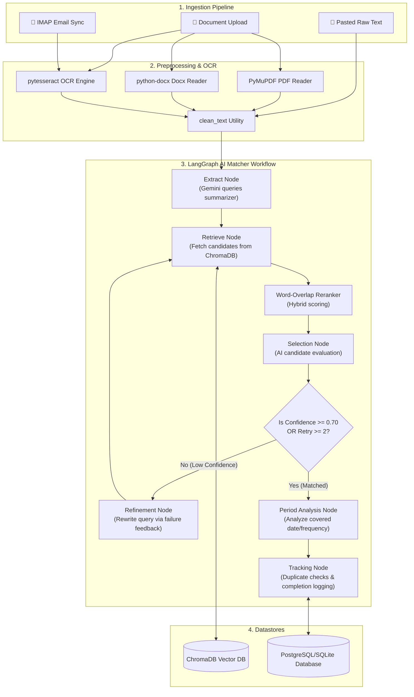

# Agentic Compliance Management System

An advanced, autonomous AI-powered compliance management system designed to streamline the tracking and execution of corporate compliance tasks. 

This platform uses **LangGraph**, **ChromaDB**, **Google Gemini GenAI**, and **Streamlit** to autonomously parse documents and emails, correctly categorize them into compliance tasks, and update an auditable event ledger.

## 🌟 Key Features

- **Agentic Workflow**: A LangGraph-based AI agent that extracts, retrieves, reranks, and refines queries iteratively to perfectly match unstructured documents with compliance tasks.
- **Multi-Modal Document Processing**: Automatically OCRs images (PyTesseract), reads PDFs (PyMuPDF), and parses Word documents.
- **Autonomous Gmail Ingestion**: A background IMAP worker securely fetches unread emails, parses attachments, and processes them through the AI workflow automatically—filtering out promotional spam.
- **Period & Frequency Analysis**: Understands if a compliance task is yearly, monthly, or quarterly, and automatically tags the correct completion period.
- **Secure Administrator Panel**: Role-based access control with a full administrator dashboard to manage tasks, monitor logs, and add tracked IMAP accounts.

## 🏗 Architecture

The platform is designed with a modular, ingestion-first architecture. It combines deterministic parsing algorithms with stateful, agentic workflows to convert unstructured compliance documents into audited ledger logs.



### Component Details
1. **Frontend UI**: Built with Streamlit, providing real-time engine tuning (sliders for candidate retrieval counts, toggle options for keyword reranker, and tracing options to display OCR extractions and graph state transitions).
2. **Ingestion & Preprocessing**: OCR pipeline using PyTesseract (with contrast enhancement and grayscale conversion) and PyMuPDF to extract text from images, scanned PDFs, and DOCX files. It filters IMAP Gmail streams to fetch unseen emails, discarding promotions and spam.
3. **ChromaDB Vector Store**: Indexes compliance rules using the `all-MiniLM-L6-v2` embedding model. Performs semantic search over indexed rules.
4. **Keyword Reranker**: Integrates lexical keyword overlap sorting on top of semantic vector distance (hybrid search model) to boost matches containing specific IDs, locations, or entities.
5. **LangGraph AI Matcher**: Executes a cyclic graph loop that:
   - Summarizes document text into a concise search query.
   - Searches ChromaDB for compliance candidates.
   - Evaluates match confidence using structured outputs with Gemini.
   - If confidence is below `0.70`, refines the search query using previous reasoning and retries up to 2 times.
   - Extracts date tokens matching frequency (e.g. `YYYY-MM` or `YYYY-QX`) using period analysis.
6. **Relational Database & Auditable Ledger**: Stores tasks, user configurations, and audit logs securely in PostgreSQL or SQLite using SQLAlchemy.

## 📂 Project Structure

```
├── app.py                  # Main Streamlit application entry point
├── seed_100_tasks.py       # Seeding script to initialize the PostgreSQL database and index tasks in ChromaDB
├── requirements.txt        # Package dependencies
├── system_walkthrough.md   # Inline architecture walk-through
├── views/                  # Streamlit Multi-Page View Files
│   ├── matcher.py          # Compliance AI matching workflow page
│   ├── add_task.py         # Create Compliance Rule page
│   ├── manage_emails.py    # IMAP Integrations management page
│   └── task_dashboard.py   # Audit & Analytics dashboard page
└── src/                    # Core compliance intelligence engine
    ├── __init__.py         # Package declaration
    ├── config.py           # Configuration parameters and LLM system prompts
    ├── database.py         # PostgreSQL schema definition and SQLAlchemy CRUD operations
    ├── document_processor.py # PDF, Word, and OCR text extraction functions
    ├── retrieval.py        # ChromaDB setup and search utility functions
    ├── agent_workflow.py   # LangGraph-based AI matching agent logic
    ├── gmail_service.py    # Email processing and attachment extractor
    └── scheduler.py        # Background thread to sync unread emails periodically
```

## 🚀 Getting Started

### Prerequisites
- Python 3.9+
- PostgreSQL (Optional, defaults to SQLite if configured)
- Tesseract OCR (must be installed on your system for image processing)

### Installation

1. **Clone the repository:**
   ```bash
   git clone https://github.com/yourusername/compliance-management.git
   cd compliance-management
   ```

2. **Install dependencies:**
   ```bash
   pip install -r requirements.txt
   ```

3. **Configure Environment Variables:**
   Copy the example `.env` file and add your Google API key.
   ```bash
   cp .env.example .env
   ```

4. **Run the Application:**
   ```bash
   streamlit run app.py
   ```

### Default Credentials
Upon initial run, a default administrator is generated:
- **Username:** `admin`
- **Password:** `password123`

*(You are encouraged to change this or register a new admin immediately via the UI).*

## 📧 Autonomous Email Tracking
To enable email tracking:
1. Log in to the application.
2. Navigate to **Manage Emails**.
3. Add a Gmail address and an **App Password** (Requires 2-Step Verification on Google).
4. The background scheduler will automatically pull and process emails every hour. You can also manually trigger it via the "Sync Now" button.

## 🛠 Tech Stack
- LangChain & LangGraph
- Streamlit
- ChromaDB
- SQLAlchemy

## 📄 License
MIT License. See `LICENSE` for more information.
